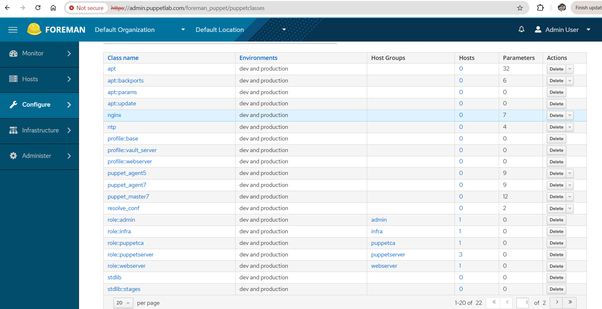
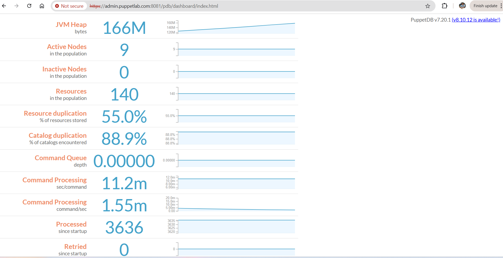

# Puppet HA Lab on AWS — Puppet 5 → 7 with Zero-Touch Provisioning

A production-style Puppet platform built from scratch on AWS: highly available masters and CA,
Foreman as the ENC, PuppetDB for reporting, and new servers that configure themselves with no
manual steps. Built on Puppet 5 and upgraded to Puppet 7 without downtime.

## Architecture

| Node | Role |
|---|---|
| puppetca1 | Active CA + primary load balancer (HAProxy, dnsmasq) |
| puppetca2 | Standby CA (continuously synced) |
| puppetmaster1-3 | Compile masters behind HAProxy (puppetmaster1 is also the secondary load balancer) |
| admin | Foreman 3.1 (ENC), PuppetDB, hammer CLI |
| worker1-3 | Application nodes: infra (vault), webserver (nginx), admin (base) |

Two AWS accounts with peered VPCs, built with Terraform.

## What it does

- **High availability:** three load-balanced compile masters, an active/standby CA with
  automatic failover, and DNS that fails over between two load balancers.
- **Zero-touch onboarding:** a new EC2 instance reads its own tags, registers itself in its
  Foreman hostgroup, gets its certificate signed automatically and is fully configured on the
  first Puppet run.
- **Roles and profiles:** each Foreman hostgroup has exactly one role; Hiera holds the data per
  hostgroup and for the whole fleet.
- **Secrets kept out of code:** the Foreman API token lives in AWS SSM Parameter Store; Terraform
  only grants read access to it.
- **Code delivery:** r10k deploys every Git branch to all masters as a Puppet environment.
- **Reporting:** PuppetDB stores facts, catalogs and reports; fleet inventory with one command.
- **Puppet 5 → 7 upgrade:** CA first, a canary master taken out of the load balancer, catalogs
  compiled on both versions and compared, then the rest of the fleet, with backups and rollback.

## Design decisions

- **Foreman as the ENC** — classification is data (hostgroup → role), not code per node, so the
  design scales to any number of nodes.
- **One role per hostgroup** — a node's purpose is defined in one place.
- **Node identity from EC2 tags** — Terraform sets `Hostname` and `Hostgroup`; no per-node files.
- **SSM Parameter Store for the token** — never in Terraform code, state or user data.
- **CA before masters before agents** — an agent must never be newer than its server.

## Repositories

| Repository | Contents |
|---|---|
| [puppet-ha-lab](https://github.com/vishwaae/puppet-ha-lab) | This repo: runbook, Terraform, lab files |
| [puppet-control-repo](https://github.com/vishwaae/puppet-control-repo) | Puppetfile, roles, profiles, Hiera data |
| [puppet-modules](https://github.com/vishwaae/puppet-modules) | nginx, ntp, vault, puppet_agent7, puppet_master7 |

## Repository layout

puppet-ha-lab/
├── README.md
├── docs/
│ ├── runbook.md Step-by-step build and upgrade guide
│ └── images/ Diagram and screenshots
├── terraform/
│ ├── puppetmaster/ puppetmaster1-3, puppetca1
│ ├── worker_setup/ network, admin, puppetca2
│ └── worker_setup-agent/ worker1-3 (zero-touch)
└── lab-files/ Config files and scripts used in the runbook

## How to build it

Follow [docs/runbook.md](docs/runbook.md). Every step lists the node to run it on, the command,
why it is needed and how to validate it before moving on.

## Screenshots

| Foreman hosts | PuppetDB dashboard |
|---|---|
|  |  |

## Author

Vishwaa Ekambaram — DevOps Engineer · [LinkedIn](https://www.linkedin.com/in/vishwaa24)